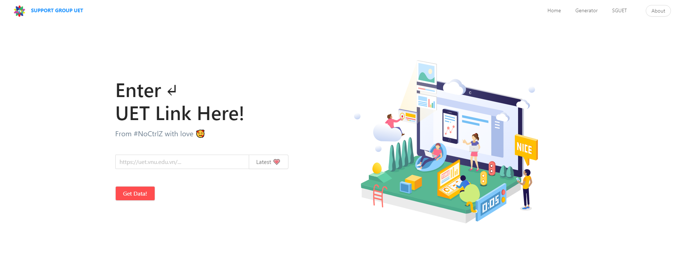

## 🥰 A simple tool, a small gift for my [#SGUET](https://www.facebook.com/SupportGroupUET/) 🥰
*Using ReactJS + Ant Design*
</br>
</br>

<a href="https://sguet.noctrlz.me/"></a>

#
### Deployed here: 🔗  https://noctrlz1110.github.io/sguet-news/
#

<br/>

```
- First commit : May 12 , 2020 
```
```
- Completed    : August 5, 2020
```

```
- Fork & create pull request 
```
```
- Don't forget star this repo if you found it helpful 😉 
```
<br/>

### How to run :
#

- ``` npm install ```
  
- ``` npm start ```
#


### Developed by : [```Nguyễn Văn Huy```](https://www.facebook.com/NoCtrlZ)

#

<p align="center">
<a href="https://www.facebook.com/SupportGroupUET/">

</a>
</p>
